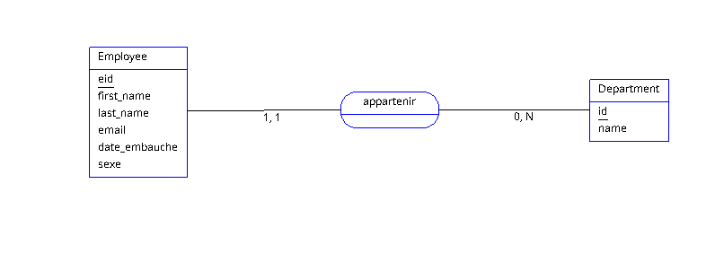

# Employee Manager CRUD Application

This is a simple CRUD (Create, Read, Update, Delete) application for managing employees. Each employee is associated with a department, and the project implements a relational database model. The application is built using Express.js, EJS, and Bootstrap, POSTGRESQL.

## Features

- Create new employees and assign them to a department.
- Update employee details.
- Delete employees.
- View the list of employees with their associated departments.
- Modals for user registration and department creation.
  
## Entity Relationship Diagram (ERD)

The diagram below represents the relationship between `Employee` and `Department`:



- **Employee**: Each employee has a `first_name`, `last_name`, `email`, `date_embauche`, and `sexe`.
- **Department**: Each department has an `id` and a `name`.
- Each employee belongs to one department, while a department can have multiple employees.


## Technologies Used

- **Backend**: [Express.js](https://expressjs.com/)
- **Templating Engine**: [EJS](https://ejs.co/)
- **Frontend**: [Bootstrap 5.3](https://getbootstrap.com/)
- **Database**: [PostgreSQL](https://www.postgresql.org/)

## Installation

1. Clone the repository:
    ```bash
    git clone https://github.com/Herimanjaka007/employee-manager.git employee-manager
    ```

2. Install dependencies:
    ```bash
    npm i
    ```

3. Configure PostgreSQL:
    - Create a PostgreSQL database:
      ```bash
      createdb employee_manager_db
      ```
    - Set up the environment variables for your PostgreSQL connection in a `.env` file:
      ```
      DB_HOST=localhost
      DB_USER=your_username
      DB_PASSWORD=your_password
      DB_NAME=employee_manager_db
      DB_PORT=5432
      ```

4. Start the application:
    ```bash
    npm run dev
    ```

5. Open your browser and go to:
    ```
    http://localhost:3000
    ```

## License

This project is licensed under the MIT License.

## Author

- **Herimanjaka Razakasoa** - [github-profile](https://github.com/Herimanjaka007)

